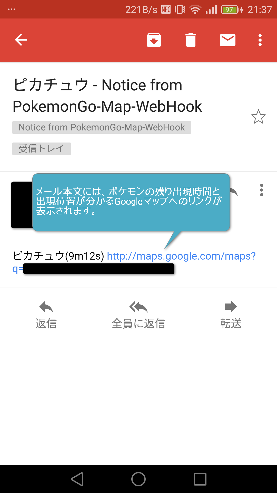

# PokemonGo-Map-WebHook
Reciever for PokemonGo-Map WebHook  

## Description
本ツールはPokemonGo-Map(Reborn)のWebHook機能によるプッシュ通知を受信し、
指定したメールアドレスへ"ポケモン"の出現を通知する。  
なお、現在はTLS通信を使用しているメールサービスのみ動作する(GMailとOutlook.comのみ動作確認済)  
* *  
* *  
## Requirement
[http-parser](https://pypi.python.org/pypi/http-parser/ "http-parser")を利用している
  
  
## Install
1.[PokemonGo-Map](https://github.com/PokemonGoMap/PokemonGo-Map "PokemonGo-Map")が起動できる状態にする  
  
2."pip install http-parser"を実行  
  
  
## Usage
1."config.ini"に通知したいメールアドレスとそのSMTPサーバに関する情報を入力します。  
  
2."NoticePokemon.csv"で通知する"ポケモン"を設定します。通知する場合は"1"、通知しない場合は"0"を各行の3番目の要素に入力します。編集は"Excel"とか矩形選択できる"秀丸"使うと捗ります(私が使っているのはExcelもどきですがｗ)  
  
3."python WebHookReciever.py"を実行します。これで"PokemonGo-Map(Reborn)"からの通信を待っている状態になります。  
  
4."PokemonGo-Map(Reborn)"を起動します。起動オプションに"-wh `http://127.0.0.1:41111`"と"--webhook-updates-only"を入れることを忘れないでください。それと複垢の場合は"--webhook-updates-only"と"--db-threads"と"--db-max_connections"も入れておいた方が良いかもしれません(複垢でテストしていないので必要性があるか確証ないですが)。取り敢えず2か3あたり指定しておけば安心かも。  
  
  
**GMailを使用する場合**  
初っ端はブロックされますｗ  
Googleからログインをブロックした旨のメールが飛んでくると思うので、
その中段あたりの"ログインしようとしましたか？"の項の文中にある"安全性の低いアプリへのアクセスを許可"のリンクに飛び、許可の設定をしてください。  
以降はWebHookによるメールが受信できます。事前にGoogleのアカウント設定からこの設定をしてもOKです。  
ちなみにOutlook.comは何も要らなかったので、捨て垢取って使うのもありかもしれません。
  
  
## Other
Reborn版？すげえ！  
WebHookもできんの？すげえ！  
(いろいろやってみる)　→独自形式のJSONだから外部サービスに送っても意味ないじゃん…そもそもSNS系に送ったら炎上するだけだし、メッセンジャー系だと無料でメッセージ数無制限なのHipChatだけやんけ  
  
仕方ないのでこれを作りました。  
いろいろ調べて見ると、同様のものもいくつか作られてるんだけどうまく動かないのよね。  
このツールは単純にソケット受信しているだけなので、環境依存せず動くと思います。(たぶん)  
  
ちなみにPokemonGo-Map(Reborn)のWebHook機能はHTTPのPUSHを投げていますが、本ツールはレスポンスを返していませんｗ  
PokemonGo-Map(Reborn)の処理内で例外発生しまくりですが、動作に影響ないようなので放置してます

